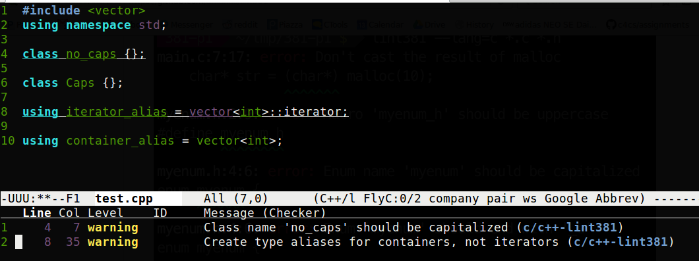

# lint381   

`lint381` checks your EECS 381 projects for coding style errors.

See http://umich.edu/~eecs381/ for the course homepage. The coding standards
can be found here:

  * [C coding standard](http://umich.edu/~eecs381/handouts/C_Coding_Standards.pdf)
  * [C++ coding standard](http://umich.edu/~eecs381/handouts/C++_Coding_Standards.pdf)

Here's `lint381` in action:

# Usage

`lint381` requires Python 3, so you may want to install it inside a `virtualenv`
or use `pip3` instead of `pip`.

Install it:

    $ pip install lint381

Pass source files to `lint381` to have it check them. Typically you'll just use
a pattern like `*.cpp *.h` to match all source files in the current directory.

    $ lint381 *.cpp *.h

If `lint381` detected any errors, it will exit with a non-zero status and print
the errors. Otherwise it will exit with zero and produce no output.

By default, `lint381` assumes your source files are in C++. You can explicitly
set the language with `--lang=c` or `--lang=cpp`:

    $ lint381 --lang=c *.c *.h

# Features

## C checks

The C linter flags the following:

  * Use of prohibited types (such as `unsigned` and `float`).
  * Macros that start with an underscore, as they are reserved by the
	implementation.
  * Non-uppercase `#defines` (`#define foo` is wrong, `#define FOO` is right).
  * `struct`s and `enum`s that aren't capitalized.
  * `enum`s that don't end with `_e`.
  * `typedef`s that don't end with `_t`.
  * Non-idiomatic comparison to `NULL` (such as `if (foo == NULL)`).
  * Enum members that aren't all-caps.
  * Casting the result of `malloc` (such as `foo = (char*) malloc(...)`).
  * Defining string constants as an array instead of a pointer.
  * Use of sizeof(char)

## C++ checks

The C++ linter flags the following:

  * All C checks above, except those that are obviated (e.g. we now use
	`nullptr` instead of `NULL`, and don't use `malloc`).
  * Comments with three asterisks (`***`) as those are provided by Kieras and
	should be removed.
  * Use of `NULL` instead of `nullptr`.
  * Use of `malloc`/`free` instead of `new`/`delete`.
  * Use of `typedef` instead of `using`.
  * Use of prohibited functions such as `memmove` or `exit`.
  * Creating a type alias for an iterator instead of its container (i.e. `using
	Foo_t = std::vector<int>::iterator` instead of `using Foo_t =
std::vector<int>; /* ... */ Foo_t::iterator`).
  * Use of `#define` to create constants.
  * Use of `class` instead of `typename` in template parameters.
  * Use of `0` or `1` in loop conditions instead of `true` or `false`.
  * Use of `string::compare`.
  * Comparing `size()` to `0` instead of using `empty`.
  * Use of post-increment instead of pre-increment for iterators.
  * Catching exceptions by value instead of by reference.
  * Unused `using`-statements, such as `using std::cout;`.

## emacs

lint381 can now be used for inline style checking within emacs using flycheck. Download and follow the directions in [lint381.el](emacs/lint381.el) to set it up.

# License

`lint381` is licensed under GPLv3.
